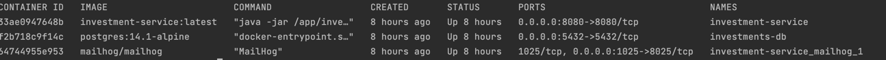

# Investments Service
[](https://github.com/Kabelo-07/investment-service/actions/workflows/workflow-dev.yml)

This is a Investment management application that provides investors with capabilities to:
* View their profile and investment products.
* Process withdrawals from their investment products. 


## Tools used
For building and running the application, the below tools were used

- [docker-compose](https://docs.docker.com/compose/install/)
- [Java 17](https://www.oracle.com/java/technologies/javase/jdk17-archive-downloads.html)
- [Maven](https://maven.apache.org/install.html)
- [Spring Boot](https://spring.io/)
- [MapStruct](https://mapstruct.org/)
- [Lombok](https://projectlombok.org/)
- [H2](https://www.h2database.com/html/main.html) Used for execution of Component/Integration Tests
- [PostgreSQL](https://www.postgresql.org/) Main DB for service 
- [SpringDoc OpenAPI](https://springdoc.org/v2/) For API documentation 
- [Liquibase](https://docs.liquibase.com/home.html) For database migration Management
- [Mailhog](https://docs.liquibase.com/home.html) For Email Testing
- [FreeMarker](https://freemarker.apache.org/index.html) Java Email Template engine

## Requirements
For building and running the application, please ensure the above tools/libraries have been installed and configured

To build the application, navigate to the project's root folder and run the below

`./mvnw clean install`

## How to run the application
To run the application, the root folder contains a `docker-compose.yaml` where the `investment-service`, `investment-db` and `mailhog` services have been defined.

Make sure that docker is installed on your machine and is up and running. Simply run `docker ps` on your terminal to confirm

## Verify services are up and running 
While on the project's root folder on the terminal, run the below command to start the services => this will create and start the service containers

`docker-compose -f docker-compose.yaml up -d`

Execute `docker ps` from the terminal to check if the containers are up and running, below is an example result of running docker ps:



We can check a specific container's logs by running: `docker logs <CONTAINER_ID> -f`.

## Verify investment-db service (PostgreSQL) is up and running

Copy the CONTAINER_ID of the `investment-db` container service and run (based on above screenshot, the container Id is f2b718c9f14c. NOTE: It will be different for you):
```
docker logs f2b718c9f14c -f 
```

Once it is up and running, you should see something like this in the logs

```
/usr/local/bin/docker-entrypoint.sh: running /docker-entrypoint-initdb.d/investments-db-init.sh
CREATE ROLE
CREATE DATABASE
GRANT
You are now connected to database "investments_db" as user "pguser".
BEGIN
CREATE TABLE
CREATE INDEX
COMMIT

2023-07-25 22:44:27.937 UTC [36] LOG:  received fast shutdown request
waiting for server to shut down....2023-07-25 22:44:27.939 UTC [36] LOG:  aborting any active transactions
2023-07-25 22:44:27.956 UTC [36] LOG:  background worker "logical replication launcher" (PID 43) exited with exit code 1
2023-07-25 22:44:27.956 UTC [38] LOG:  shutting down
2023-07-25 22:44:28.072 UTC [36] LOG:  database system is shut down
 done
server stopped

PostgreSQL init process complete; ready for start up.

2023-07-25 22:44:28.271 UTC [1] LOG:  starting PostgreSQL 14.1 on aarch64-unknown-linux-musl, compiled by gcc (Alpine 10.3.1_git20211027) 10.3.1 20211027, 64-bit
2023-07-25 22:44:28.285 UTC [1] LOG:  listening on IPv4 address "0.0.0.0", port 5432
2023-07-25 22:44:28.285 UTC [1] LOG:  listening on IPv6 address "::", port 5432
2023-07-25 22:44:28.288 UTC [1] LOG:  listening on Unix socket "/var/run/postgresql/.s.PGSQL.5432"
2023-07-25 22:44:28.296 UTC [54] LOG:  database system was shut down at 2023-07-25 22:44:28 UTC
2023-07-25 22:44:28.306 UTC [1] LOG:  database system is ready to accept connections

```

NOTE: if you dont see the above, just run `docker-compose -f down --volumes` to clear any volumes that might be preventing the db from being created

### Database creation
On investment-db container startup, an initialization script `investments-db-init.sh` (located in `db/` folder in the project's root directory) is executed. This creates the required `investment_db` in PostgreSQL 

```
/usr/local/bin/docker-entrypoint.sh: running /docker-entrypoint-initdb.d/investments-db-init.sh
CREATE ROLE
CREATE DATABASE
GRANT
You are now connected to database "investments_db" as user "pguser".
```

## Verify mailhog service (Mail provider) is up and running

Copy the CONTAINER_ID of the `mailhog` service container and run (based on above screenshot, the container Id is 64744955e953. NOTE: It will be different for you):
```
docker logs 64744955e953 -f 
```

Once it is up and running, you should see something like this in the logs
```
[HTTP] Binding to address: 0.0.0.0:8025
2023/07/25 22:44:21 Serving under http://0.0.0.0:8025/
2023/07/25 22:44:21 [SMTP] Binding to address: 0.0.0.0:1025
```

## Verify investment-service is up and running

Copy the CONTAINER_ID of the `investment-service` container and run (based on above screenshot, the container Id is 33ae0947648b. NOTE: It will be different for you):
```
docker logs 33ae0947648b -f 
```

Once it is up and running, you should see something like this in the logs
```
2023-07-25T22:45:10.553Z  INFO 1 --- [           main] o.s.b.w.embedded.tomcat.TomcatWebServer  : Tomcat started on port(s): 8080 (http) with context path ''
2023-07-25T22:45:10.638Z  INFO 1 --- [           main] c.i.InvestmentServiceApplication         : Started InvestmentServiceApplication in 41.235 seconds (process running for 47.592)
```

### Execution of Liquibase changelogs
The application uses Liquibase for Database migration. Meaning all required Database Objects (tables, Indexes etc..) are managed using liquibase.
The DB changelogs can be located in the `resources/db/changelog` folder. The `master.xml` is the changelog file located/used by spring to execute the changelogs

### Data initialization
The `resources/db/test-data` folder contains three CSV files used for inserting data into the create tables on application startup.

In the application logs, we should see something like this in the logs to confirm that the db changeLog files have been executed.
```
Running Changeset: db/changelog/20230723094500_create_investors_table.xml::20230723094500-1::kmashishi
2023-07-25T22:44:50.995Z  INFO 1 --- [           main] liquibase.changelog                      : Table investors created
2023-07-25T22:44:50.998Z  INFO 1 --- [           main] liquibase.changelog                      : ChangeSet db/changelog/20230723094500_create_investors_table.xml::20230723094500-1::kmashishi ran successfully in 93ms
2023-07-25T22:44:51.005Z  INFO 1 --- [           main] liquibase.executor                       : Changelog query completed.
2023-07-25T22:44:51.012Z  INFO 1 --- [           main] liquibase.executor                       : Changelog query completed.
```

## Accessing API documentation
Once the application is up and running, the API documentation can be accessed from the links below:

* [Swagger UI](http://localhost:8080/swagger-ui/index.html)
* [OpenAPI Yaml file](http://localhost:8080/v3/api-docs.yaml)

## Testing the Service
Please check this document for testing
- [Testing the Service](TESTING.md)

## Stopping the service

To stop the service, run `docker-compose -f docker-compose.yaml down --volumes`

## Developer
* Kabelo Mashishi ([Kabelo.Mashishi@icloud.com](Kabelo.Mashishi@icloud.com))
