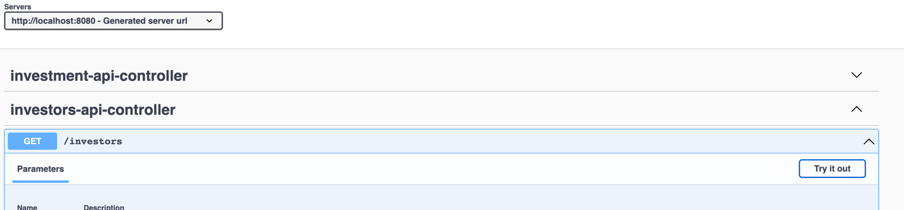
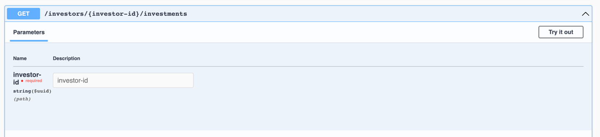
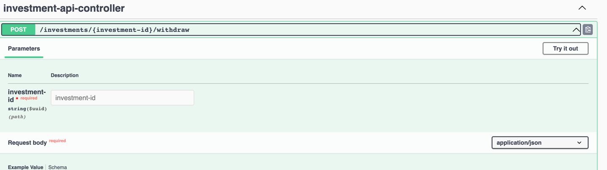
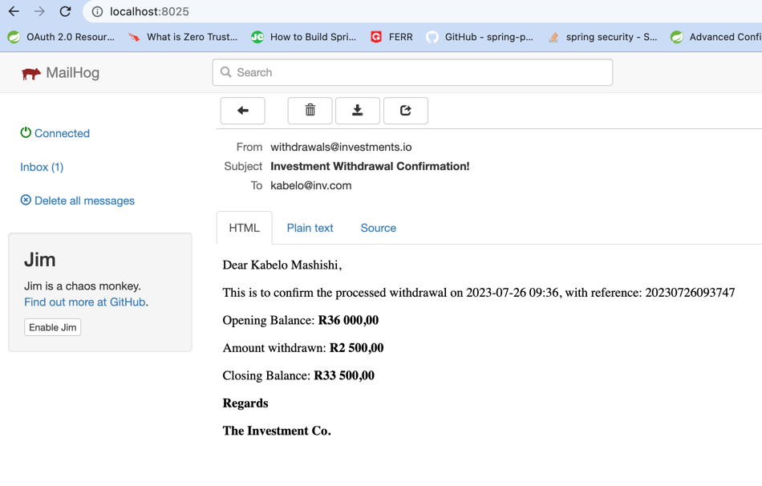

# Investments Service Testing
For getting the Application Up and running, visit below doc:
* [Getting service Up and Running](README.md)

# Testing in Swagger API Documentation
We can test directly in swagger API document accessed from below

* [Swagger API Documentation](http://localhost:8080/swagger-ui/index.html)

## Listing Investors
Once Swagger UI is open, to get a list of Investors, expand `investors-api-controller`, the operation/resources to be accessed is `HTTP GET /investors`  

## Listing Investor's Investment products 
To get a list of Investor's investment-products, expand `investors-api-controller`, the operation/resources to be accessed is `HTTP GET /investors/{investor-id}/investments`

Note: investor-id can be obtained/copied from the previous step.

## Process Investment Product Withdrawal
To process a investment product withdrawa, expand `investments-api-controller`. Required request body schema is provided in the documentation

## Receiving of Email
Once a withdrawal has been processed successfully, an email will be sent out to the Investor's email address.

We are using Mailhog for email, which can be opened from below link

[Mailhog](http://localhost:8025/)

Below is a screenshot of email received with withdrawal info

